# Command Line Interface Documentation for E-Z Reader

# Abstract

E-Z Reader is a computational model of eye-movement control during reading that not only can explain how saccadic programming, visual constraints, attention allocation, and lexical processing jointly affect eye movement during reading, but also address how higher level post-lexical language processing affects eye movements. With a few simple assumptions, the model can account for the fact that the effects of higher level language processing are not observed on eye movements when such processing occurs without difficulty, but can be captured when such processing is slowed or disrupted [2]. The first part of the instructions describes how to run simulations on the **Command Line Interface** using the Schilling, Rayner, and Chumbley (1998) sentence corpus. The second part describes five types of simulation output using the default corpus. The third part describes how to run simulations using your own sentence corpus. The fourth part describes all the free parameters used in the simulation.

# Running Simulations

To run a default simulation, download the files to a common folder and run `Terminal`. Locate to the folder that stores all the program files, enter `java CLI`, and press `Enter`. This should run a simulation using two default files (`SRC98Corpus.txt` and `SRC98Targets.txt`) and default values for all free parameters, and the result would be a file named `DefaultResults.txt` under the project folder.

Type `java CLI -h` to view the usage document in `Terminal` (see *Figure 1*). 

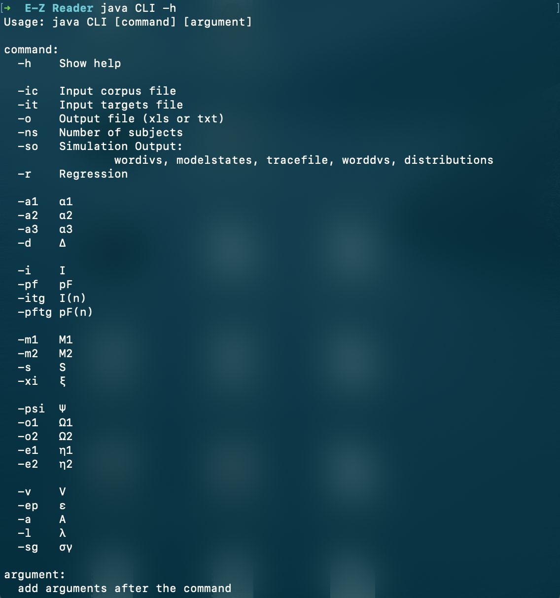

Figure 1. Show the usage document by typing the `-h` command

You can reset any other parameter if necessary.

You can use another **Corpus File Name** by:

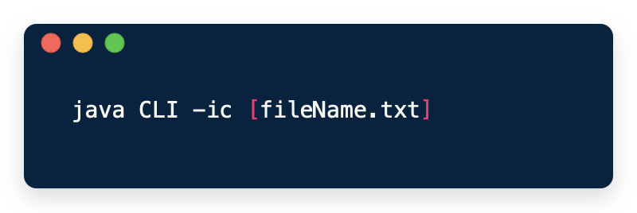

Figure 2. `-ic` command to customize corpus file

This is the file containing the sentences that will be used in the simulation. The example file `SRC98Corpus.txt` contains the 48 sentences used by Schilling et al. (1998) in their eye-movement experiment and subsequently used to evaluate different versions of the E-Z Reader model.

You can use another **Targets File Name** by:


Figure 3. `-it` command to customize targets file

Remember to store the files under the same folder prior to run the simulations.

You can set the **number of statistical subjects** (1-10,000) that will be used in completing the simulation by:


Figure 4. `-ns` command to customize number of subjects

You can set the **Output File Name** by:


Figure 5. `-o` command to customize output file name

The Output File Name names the file to which the result of simulation will be written. It will be stored under the project folder. 

Changing the `.txt` file extension to `.xls` will cause the output to be formatted for a space-delimited Excel file for a easier analysis process.

# Types of Simulation Output

There are five types of simulation output that can be written into the output files.

### Word IVs

`java CLI -so wordivs` This will output all of the independent variables associated with all words in the sentence file that are calculated by the program prior to executing a simulation. It's a useful to run the simulation prior to completing any others to ensure that the sentence file has been formatted correctly [3]. *Figure 6* shows an example of the first part of the output from this type of simulation and an explanation of what it means:

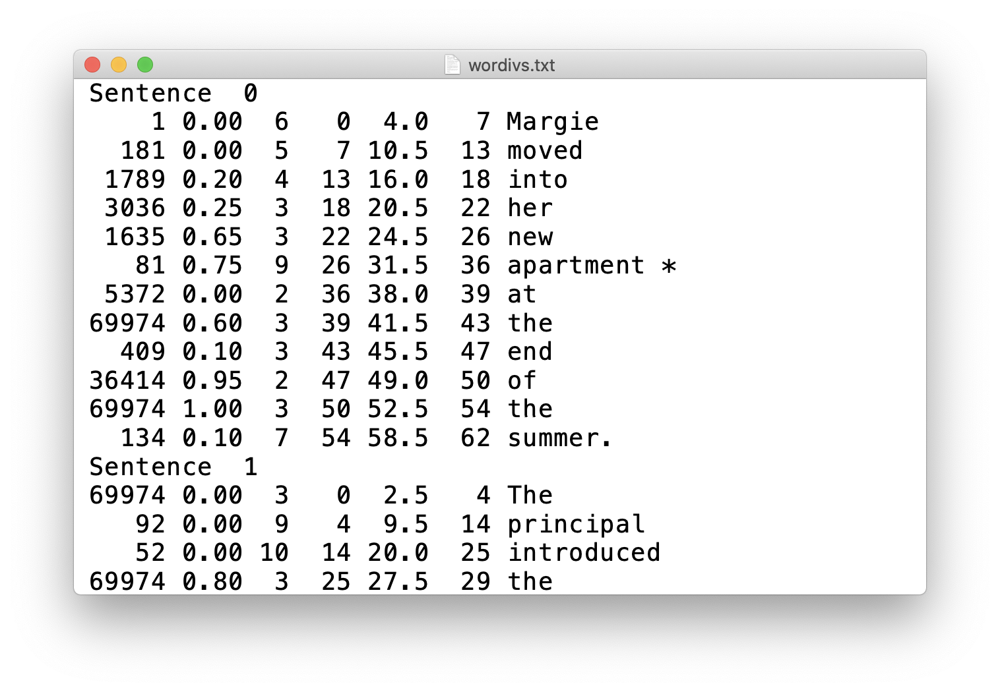

Figure 6. Example output file from the `Word IVs` simulation

The above example shows the first sentence (i.e., “Sentence: 0”) and part of the second (i.e., “Sentence: 1”). Following Java conventions, sentences and words are always numbered starting from 0, so that a set of N sentences/words will be numbered from 0 to N-1 [3]. 

Each row shows the following information for a given word:

1. its frequency of occurrence in printed text [1]
2. its close predictability
3. its length (i.e., number of letters)
4. the cumulative character position of the space immediately to the left of the word
5. the cumulative character position of the center of the word (i.e., its OVP)
6. the cumulative character position of the right side the last character in a word
7. the actual word
8. an asterisk marking target words

### Model States

`java CLI -so modelstates` It causes the model to write out all of the internal states that it progresses through as it “reads” the sentences. This type of output is useful for seeing how the model works, and can sometimes be useful for figuring out exactly why the model makes certain predictions. Because the output files are very large (each word that is processed might cause the model to go through more than 10 states), it is a good idea to use only a very small number of subjects when running this type of simulation. *Figure 7* shows an example of the output and an explanation of what it means [3]:

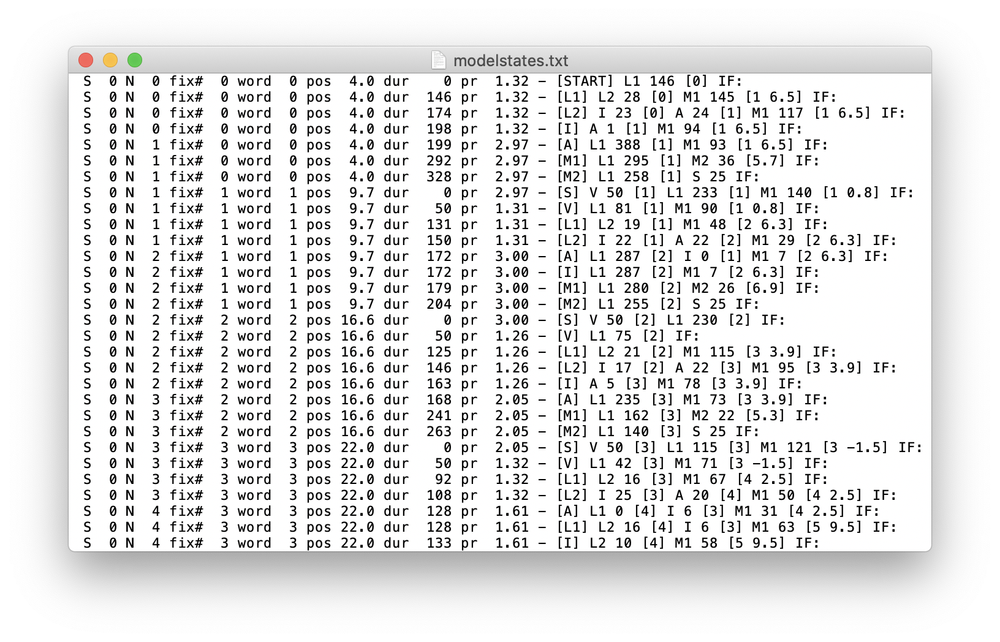

Figure 7. Example output from `Model States` simulation.

The above example shows consecutive model states, displayed one per row. 

Within each row, the following information is provided (from left to right) [2]:

1. `S` - the current sentence being read (e.g., the first sentence)
2. `N` - where attention is located (i.e., the word being processed)
3. `fix#` - the fixation number
4. `word` - the word being fixated
5. `pos` - the cumulative character position of the current fixation location
6. `dur` - the duration of the current fixation
7. `pr` - the current rate of lexical processing
8. a model state (as described below)
9. a list of on-going processes and information associated with those processes (also as described below)
10. `IF` - a list of words for which integration has failed (e.g., as shown in the last row, integration has failed for words 4 and 5).

The model states listed in **No.8** above are [2]:

1. [START] - the model has started reading a sentence, the eyes are on the OVP of word 0 and L1 is initiated
2. [L1] - L1 has completed, L2 and M1 are initiated
3. [L2] - L2 has completed, A and I are initiated
4. [I] - I has completed
5. [A] - A has completed, L1 is initiated
6. [M1] - M1 has completed, M2 is initiated
7. [M2] - M2 has completed, S is initiated
8. [S] has completed, V is initiated
9. [V] - V has completed, the rate of lexical processing is adjusted
10. [RAPID I] - I has failed (i.e., rapid integration failure)

These states are labeled in the source code for the model (see the values of the variable labeled “state” in Model.java.) For a detailed discussion of the model states and how state transitions occur in E-Z Reader, see Reichle et al. (1998).

The on-going processes listed in **No.9** above are:

1. `V`, pre-attentive vision
2. `L1`, the first stage of lexical processing (i.e., the familiarity check)
3. `L2`, the second stage of lexical processing (i.e., lexical access)
4. `I`, post-lexical integration
5. `A`, attention shift
6. `M1`, labile saccadic programming
7. `M2`, non-labile saccadic programming
8. `S`, the saccade. 

The number immediately to the right of these labels indicates the amount of time remaining for a given process. For example, in the first row of Figure 4, “L1 226 [0]” indicates that the familiarity check (L1) will require 226 ms to complete for word 0 (i.e., the first word in the sentence). The other state labels and associated values are interpreted similarly, but for A, the number in the brackets indicates the word towards which attention is being shifted; e.g., in the third row of Figure 4, “A 24 [1]” indicates that attention will require 24 ms to shift, and that it will be shifting towards word 1. For M1, the two numbers in brackets respectively indicate the word being targeted by the saccade and the intended saccade length. And for M2, the number in brackets indicates the saccade length after both random and systematic error have been added to the intended length. For example, in the second line, the duration of M1 is 81 ms, the impending saccade will be being directed towards the center of word 1 (i.e., its OVP), with an intended saccade length of 6.5 character spaces. However, as line 6 shows, the actual saccade length is only 4.9 character spaces, which as line 8 shows, the eyes then move from the OVP of word 0 (i.e., cumulative character position 4.0) to cumulative character position 8.9 in word 1.

### Trace File

`java CLI -so tracefile` It generates a trace file that is similar to those that are generated by eye-trackers experiments using human participants. *Figure 8* shows the “trace file” output, 

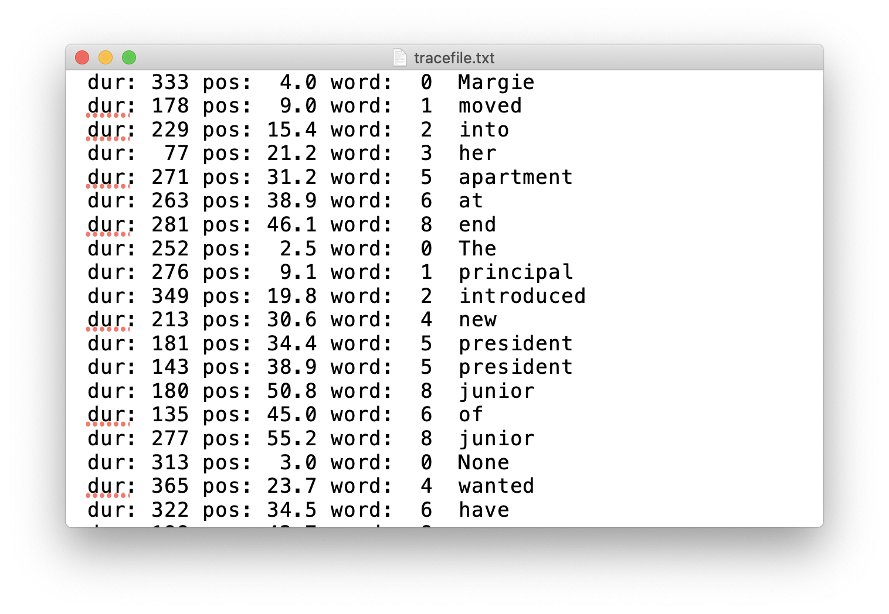

Figure 8. Example output of `Trace File` simulation

Each line contains the following information about a given fixation: 

1. its duration
2. its position
3. the word being fixated
4. the identity of that word.

### Word DVs

`java CLI -so worddvs` This output will probably be most useful for running simulations. Selecting this button will generate a number of the standard dependent measures (e.g., mean gaze durations, etc.) for each word in the sentence file. With this type of simulation, it is advisable to use a large number of subjects (e.g., 1,000) to obtain stable simulation results. Also, the predicted results for the first and last words in each sentence are not included in the output because the model: (1) starts processing the first word from its middle and with no parafoveal preview, and (2) halts abruptly (regardless of whatever is happening) when post-lexical integration of the last word has completed. *Figure 9* provides examples of the simulation output and an explanation of what it means [3]:

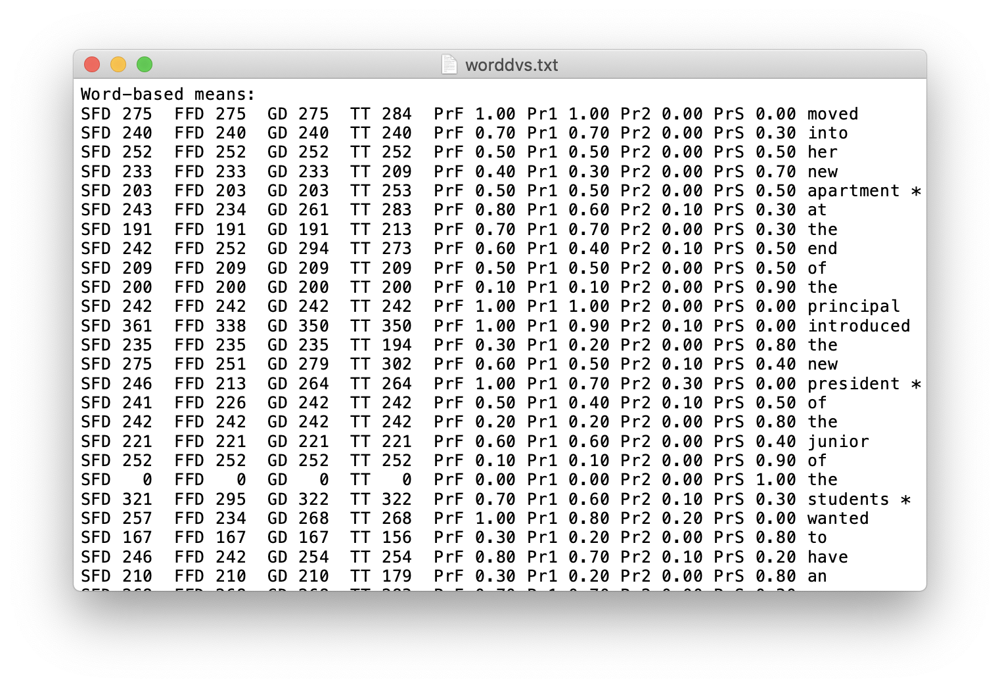

Figure 9. First example of output from `Word DVs` simulation, showing mean word-based dependent measures for each word.

The top part of the output file contains several mean dependent measures for each word in the sentence corpus [2]:

1. single-fixation duration (SFD)
2. first-fixation duration (FFD)
3. gaze duration (GD)
4. total time (TT)
5. fixation probability (PrF)
6. probability of making exactly one fixation (Pr1)
7. probability of making two or more fixations (Pr2)
8. probability of skipping (PrS). The asterisks indicate the target words that are specified by the target word input file (e.g., `SRC98Targets.txt`)

As *Figure 10* shows, the next part of the output file contains the first-fixation landing-site distributions for each word:

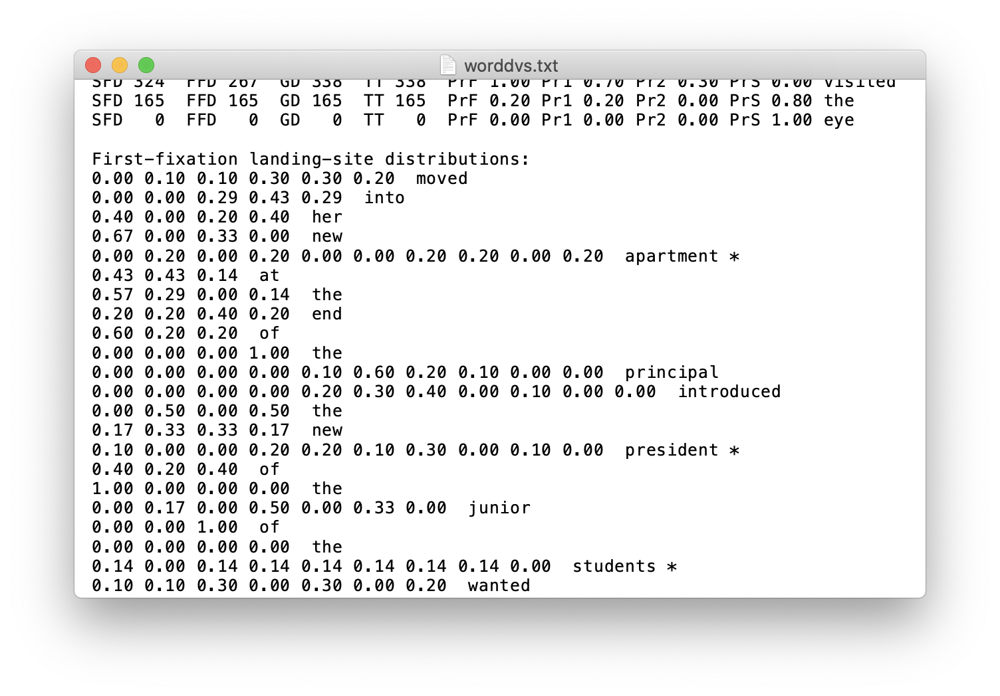

Figure 10. Second example of output from `Word DVs` simulation, showing first-fixation landing-site distributions for each word.

As *Figure 11* shows, the next part of the output file contains the refixation-probability distributions (i.e., probability of refixating from each initial fixation position) for each word [2]:


Figure 11. Third example of output from `Word DVs` simulation, showing refixation-probability distributions for each word.

As *Figure 12* shows, the bottom part of the output file contains the mean durations of single fixations as function of their positions (i.e. IOVP curves) [2]:

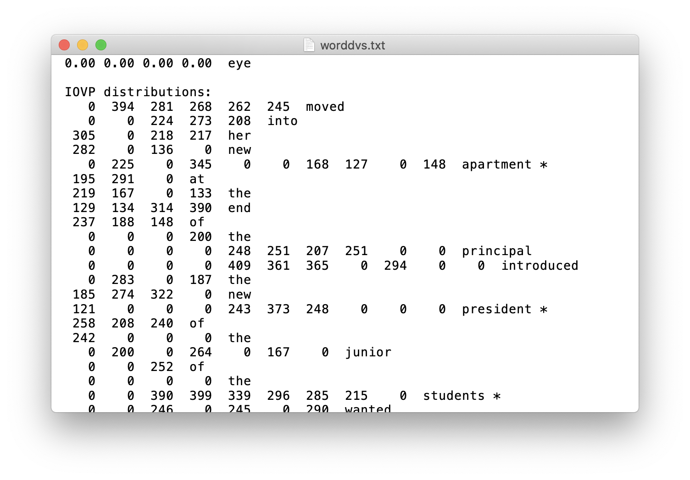

Figure 12. Final example of output from `Word DVs` simulation, showing IOVP curves for each word.

### Distributions

`java CLI -so distributions` The final type of simulation will generate three distributions across words of each given length [3]:

1. first-fixation landing-site distributions (See *Figure 13*)
2. refixation-probability distributions (See *Figure 14*)
3. IOVP curves (See *Figure 15*)


Figure 13. Example output of `Distributions` simulation, first-fixation landing-site distributions


Figure 14. Example output of `Distributions` simulation, refixation probability distributions

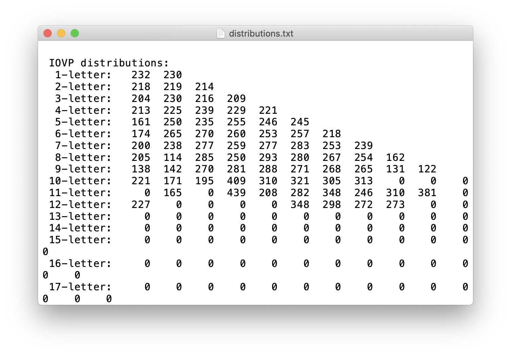

Figure 15. Example output of `Distributions` simulation, IOVP distributions

You can change the **type of simulation output** by:


Figure 16. `-so` command to customize type of simulation output

# Setting Up Sentence and Target-Word Files

This section describes how to set up these files to run simulations on sentences other than the default corpus (*Figure 16*).

The sentence file should contain four columns of information about each word’s:

1. frequency of occurrence
2. length in character spaces
3. cloze predictability
4. identity

The last word of each sentence should also be followed by an ampersand (i.e., @), as indicated in *Figure 17* below. Without this marker, the program will treat all of the words in the file are a single sentence, which may or may not be useful.

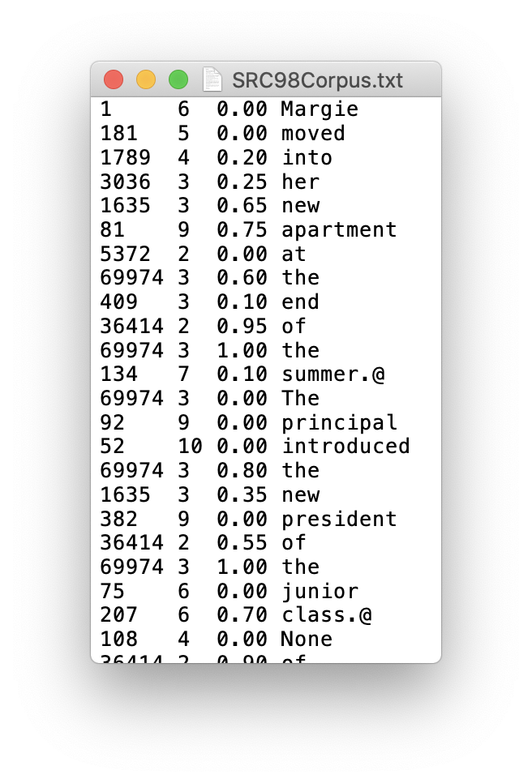

Figure 17. Example of sentence corpus file.

The target-word file is just a list identifying target words, as shown in *Figure 18*. The file contains a single column containing one number per sentence. These target words will be tagged in the simulation output (with asterisks) to make analyses of those words easier. However, if you are not interest in specific target words, this file can be set up with “dummy” numbers (e.g., a single column of 0s).

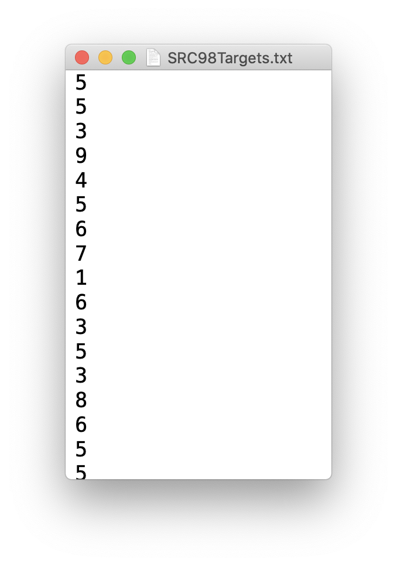

Figure 18. Example of sentence targets file.

# Customize Other Free Parameters

You will need to customize the command line arguments input whenever you need to modify any parameter or use different input files. The format of modifying a parameter follows.

```bash
java CLI [command1] [argument1] [command2] [argument2] ... [commandN] [argumentN]
```

All other commands except from above are listed below:

- `-r` whether to include regressions, chosen from below:
    - `true` regressions included
    - `false` regressions **not** included
- `-a1` $\alpha_1$ (alpha 1) - free parameter that determines rate of lexical processing
- `-a2` $\alpha_2$ (alpha 2) - free parameter that determines rate of lexical processing based on word frequencies
- `-a3` $\alpha_3$ (alpha 3) - free parameter that determines rate of lexical processing based on token predictability
- `-d` $\Delta$ (Delta) - a fixed proportion of the duration of $L_1$
- `-i` $I$ - time required to complete the postlexical integration stage
- `-pf` $p_F$ - probability where the integration of word $n$ fails
- `-itg` $I_N$ - time required to complete the postlexical integration stage for word $n$
- `-pftg` $p_N$ - probability where the eyes and attention will be directed back to word $n$, following comprehension failure.
- `-sg` $\sigma_\gamma$ (sigma_gamma) - controls the gamma distribution variability
- `-m1` $M_1$ - duration of the labile stage that can be canceled by the initiation of subsequent saccadic programs
- `-m2` $M_2$ - duration of the non-labile stage that is not subject to cancellation
- `-s` $S$ - time required for executing the actual saccade
- `-xi` $\xi$ (xi) - parameter to adjust new $M_1$ duration when pending $M_1$ is canceled
- `-psi` $\Psi$ (Psi) - defines the saccade length bias
- `-o1` $\Omega_1$ (Omega 1) - determines how the strength of saccade length bias is modulated by the launch-site fixation duration
- `-o2` $\Omega_2$ (Omega 2) - determines how the strength of saccade length bias is modulated by the launch-site fixation duration
- `-e1` $\eta_1$ (eta 1) - determines the degree where the standard deviation increases with saccade length
- `-e2` $\eta_2$ (eta 2) - determines the degree where the standard deviation increases with saccade length
- `-v` $V$ - time of the pre-attentive stage of visual processing
- `-ep` $\epsilon$ (epsilon) - controls the degree where visual acuity shows lexical processing
- `-a` $A$ - the mean time required to shift attention from word $n$ to word $n+1$
- `-l` $\lambda$ (lambda) - modulates the strength how the probability of making a refixation increases as a function of saccadic error

# Other Tips

1. Remember to store the corpus and targets file under the same folder.
2. Make sure that the model is reading in the files correctly using the `Word IVs` output option before you run any real simulations [3].
3. The sentence and target-word files should be an ascii file [3].
4. Remember that fixations on the first and last word of each sentence are excluded from analyses because the processing of these words starts and ends (respectively) abruptly.

# References

[1] Francis, W. N., & Kuera, H. (1982). *Frequency analysis of English usage: Lexicon and grammar*. Boston: Houghton Mifflin.

[2] Reichle, Erik D., Tessa Warren, and Kerry McConnell. "Using EZ Reader to model the effects of higher level language processing on eye movements during reading." Psychonomic bulletin & review 16.1 (2009): 1-21.

[3] Reichle, Erik D. "Running E-Z Reader 10.2 Simulations."